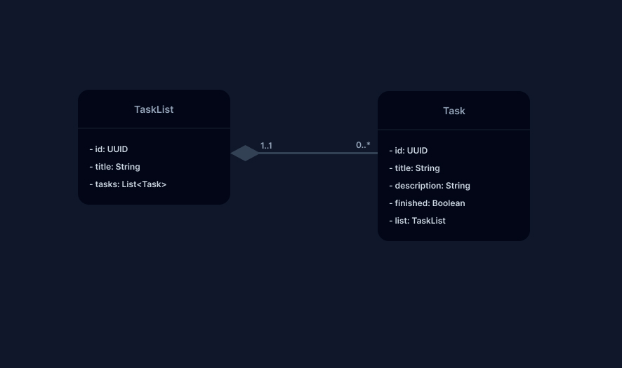

# To Do List
## Descrição
A aplicação consiste em um espaço para organização de tarefas a serem feitas, divididas em listas específicas. O usuário poderá criar diversas listas e, em cada uma, adicionar uma série de tarefas que poderão ser marcadas como concluídas.
## Tecnologias

## 🚀 Requisitos funcionais
**RF-001** - o usuário deverá manter listas de tarefas;
 
**RF-002** - o usuário deverá manter tarefas;
 
**RF-003** - o usuário deverá marcar uma tarefa como concluída;
 
## Regras de negócio
✅ **RN-001**: uma task só poderá ser criada dentro de uma lista;
 
✅ **RN-002**: ao excluir uma lista, deve-se excluir todas as tasks que ela possuía;
 
## Classes

